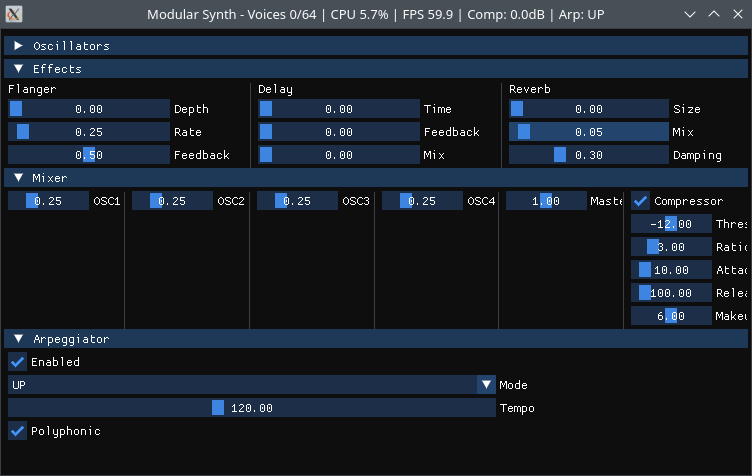

A modular synthesizer application written in C, using SDL2 for graphics and audio, and supporting MIDI input via libremidi. The GUI is resizable and features oscilloscope and spectrum displays, keyboard input, and real-time control of oscillators, effects, mixer, and arpeggiator.




[](https://github.com/koppi/sdl2-synth/actions/workflows/os.yml)
[](https://github.com/koppi/sdl2-synth/actions/workflows/web.yml)
[](https://github.com/koppi/sdl2-synth/issues)

## Features

- **4-oscillator synth**: Each with independent waveform, pitch, detune, gain, phase, pulse width, and unison controls.
- **Comprehensive Parameter Control**: All oscillator parameters accessible via intuitive combo boxes:
  - **Waveform Selection**: SINE, SAW, SQUARE, TRI, NOISE
  - **Pitch Presets**: Common semitone offsets (-24 to +24)
  - **Detune Presets**: Standard cent values (-100¢ to +100¢)
  - **Gain Presets**: Common levels (0%, 12%, 25%, 50%, 75%, 87%, 100%)
  - **Phase Presets**: Musical phase relationships (0°, 45°, 90°, 135°, 180°, etc.)
  - **Pulse Width Presets**: Standard duty cycles (10%, 25%, 50%, 75%, 90%)
  - **Unison Voices**: 1 to 8 voice layering
  - **Unison Spread**: Preset detuning amounts (Off, Tight, Medium, Wide, Extra Wide)
  - **Modern Dear ImGui Interface**: Clean, responsive GUI using the Dear ImGui library- **Mixer**: Control the mix and master volume of each oscillator with bus compression.
- **Mastering**: Professional post-processing with DC filter, soft clipping, auto gain, and level meters.
- **Effects**: Flanger, delay, reverb, and analog filter with real-time controls.
   - **Analog Filter**: Professional-grade resonant filter with multiple types and advanced processing.
     - **Filter Types**: Low-pass, High-pass, Bandpass, Notch
     - **Adjustable Cutoff**: 20Hz - 20kHz with logarithmic control
     - **Resonance (Q)**: 0.1 - 10.0 for filter peaking and character
     - **Drive Control**: 1.0 - 10.0 with soft saturation for warmth and distortion
     - **Oversampling**: 1x, 2x, 4x, 8x for aliasing reduction
     - **Inertial Smoothing**: Prevents zipper noise during parameter changes
     - **Wet/Dry Mix**: 0% - 100% for parallel processing
   - **Arpeggiator**: Multiple modes, adjustable tempo, octave control, and multi-octave chord arpeggiation.
   - **Arpeggiator Modes**: UP, DOWN, ORDER, RANDOM
   - **Octave Control**: Select base octave (0-4 = octaves 1-5) for all notes
   - **Multi-Octave Spread**: Spread chords across 1-6 octaves for rich, layered arpeggios
    - **Hold Function**: Sustain arpeggios after key release
    - **Polyphonic Mode**: Play all notes simultaneously or cycle through them in order
    - **MIDI CC Control**:
      - CC #90: Enable/disable arpeggiator
      - CC #91: Select arpeggiator mode (UP/DOWN/ORDER/RANDOM)
      - CC #92: Hold function on/off
      - CC #93: Base octave selection (0-4)
      - CC #94: Octaves spread control (1-6)
    - **Mastering**: Professional post-processing with visual feedback.
      - **DC Filter**: Removes DC offset with adjustable cutoff (1-100Hz)
      - **Soft Clipper**: Gentle clipping with threshold and knee controls (-20 to 0dB)
      - **Auto Gain**: Automatic gain adjustment to target level (-20 to 0dB)
      - **Level Meters**: Real-time peak and RMS level visualization
      - **Status Indicators**: Visual feedback for processing state
- **Multi-Octave Arpeggiation**:
  - **Rich Chords**: Set octaves=3 with a C major chord
  - **Rising Sequences**: Set octaves=2 and use UP mode with moderate tempo
  - **Descending Patterns**: Set octaves=4 with DOWN mode for descending bass lines
  - **Random Exploration**: Set octaves=6 with RANDOM mode for experimental textures
- **Oscilloscope & Spectrum**: Visualize output waveform and frequency spectrum.
- **MIDI input**: Map MIDI CC to synth parameters for external control.
- **Interactive Keyboard**: On-screen piano keyboard with visual feedback.

## Build Dependencies

- [SDL2](https://www.libsdl.org/) (graphics, audio, events)
- [SDL2_ttf](https://github.com/libsdl-org/SDL_ttf) (font rendering)
- [Dear ImGui](https://github.com/ocornut/imgui) (GUI library)
 - [libremidi](https://github.com/celtera/libremidi) (MIDI input)
 - [math.h], [string.h], [stdlib.h], [stdio.h]
 
## Build Instructions

### Linux

Install dependencies (example for Debian/Ubuntu):

```sh
sudo apt-get install git cmake ninja libsdl2-dev libsdl2-ttf-dev
```

Clone, build and run:

```sh
git clone https://github.com/koppi/sdl2-synth && cd sdl2-synth
cmake --preset release
cmake --build --preset synth-release && build/release/synth
```

### macOS

Install dependencies (with Homebrew):

```sh
brew install git ninja sdl2 sdl2_ttf
```

Then build as above.

### Windows

- Install SDL2, SDL2_ttf and libremidi development libraries.
- Use MinGW or Visual Studio to build the sources (adjust includes/libs as needed).

### Web (Emscripten)

To build the synthesizer as a WebAssembly (WASM) application that runs in the browser:

#### Setup Emscripten

First, install the Emscripten SDK:

```sh
cd /tmp
git clone https://github.com/emscripten-core/emsdk.git
cd emsdk
./emsdk install latest
./emsdk activate latest
source ./emsdk_env.sh
```

Add to your shell profile for permanent access:

```sh
echo 'source "/tmp/emsdk/emsdk_env.sh"' >> $HOME/.bashrc
```

#### Build with CMake and Emscripten

```sh
cd sdl2-synth
cmake --preset emscripten
cmake --build --preset synth-emscripten
```

This generates:
- `synth.js` - JavaScript runtime
- `synth.wasm` - WebAssembly binary

#### Serve the Web Build

Start a local web server to test:

```sh
python3 -m http.server 8000
```

Then open `http://localhost:8000` in your browser and navigate to the build output directory.

## Running

```sh
gdb build/debug/synth # debug the build
build/release/synth   # run the release build
```

The application will open a window with the synthesizer GUI.

## MIDI CC Control Mapping

This synthesizer implements General MIDI CC (Continuous Controller) mapping following standard MIDI specifications for universal compatibility with hardware controllers and DAWs. All MIDI CC messages are automatically scaled from MIDI range (0-127) to the appropriate parameter ranges.

### Standard MIDI CC Assignments

#### General MIDI Controllers (CC 1-31)
- **CC 1**: Modulation Wheel → OSC 1 Detune (±1.0 semitones)
- **CC 7**: Volume (Channel Volume) → OSC 1 Gain (0.0-1.0)
- **CC 10**: Pan → OSC 1 Waveform (0=SINE,1=SAW,2=SQUARE,3=TRI,4=NOISE)
- **CC 11**: Expression → OSC 1 Pulse Width (0.0-1.0)

#### Bank Select Controllers (CC 32-63)
- **CC 33**: LSB Bank Select → OSC 6 Waveform (0=SINE,1=SAW,2=SQUARE,3=TRI,4=NOISE)
- **CC 34**: LSB Bank Select → OSC 5 Waveform (0=SINE,1=SAW,2=SQUARE,3=TRI,4=NOISE)
- **CC 35**: LSB Bank Select → OSC 4 Waveform (0=SINE,1=SAW,2=SQUARE,3=TRI,4=NOISE)
- **CC 36**: LSB Bank Select → OSC 3 Waveform (0=SINE,1=SAW,2=SQUARE,3=TRI,4=NOISE)
- **CC 37**: LSB Bank Select → OSC 2 Waveform (0=SINE,1=SAW,2=SQUARE,3=TRI,4=NOISE)
- **CC 38**: LSB Bank Select → OSC 1 Waveform (0=SINE,1=SAW,2=SQUARE,3=TRI,4=NOISE)

#### Effect Controllers (CC 64-95)
- **CC 70**: Sound Controller 1 → Delay Time (0.0-1.0s)
- **CC 71**: Sound Controller 2 → Delay Feedback (0.0-1.0)
- **CC 72**: Sound Controller 3 → Delay Mix (0.0-1.0)
- **CC 73**: Sound Controller 4 → Flanger Rate (0.0-5.0 Hz)
- **CC 74**: Sound Controller 5 → Flanger Depth (0.0-1.0)
- **CC 75**: Sound Controller 6 → Reverb Size (0.0-1.0)
- **CC 76**: Sound Controller 7 → Reverb Mix (0.0-1.0)
- **CC 77**: Sound Controller 8 → Filter Cutoff (20.0-20000.0 Hz)
- **CC 78**: Sound Controller 9 → Filter Resonance (0.1-10.0)
- **CC 79**: Sound Controller 10 → Filter Drive (1.0-10.0)
- **CC 80**: Sound Controller 11 → Filter Mix (0.0-1.0)

#### Channel Pressure & Aftertouch
- **CC 2**: Breath Controller → Alternative OSC 1 Detune (±1.0 semitones)

#### Footswitches & Pedals (CC 64-127)
- **CC 64**: Damper Pedal (Sustain) → Sustain On/Off
- **CC 65**: Portamento → Portamento On/Off
- **CC 66**: Sostenuto → Sostenuto On/Off
- **CC 67**: Soft Pedal → Soft Pedal On/Off
- **CC 68**: Legato Pedal → Legato On/Off
- **CC 69**: Hold Pedal → Hold On/Off
- **CC 83**: General Purpose Controller 1 → Master Volume (0.0-2.0)
- **CC 84**: General Purpose Controller 2 → Compressor Threshold (-24.0 to 0.0 dB)
- **CC 85**: General Purpose Controller 3 → Compressor Ratio (1.0-10.0:1)
- **CC 86**: General Purpose Controller 4 → Compressor Attack (1.0-100.0 ms)
- **CC 87**: General Purpose Controller 5 → Compressor Release (10.0-1000.0 ms)
- **CC 88**: General Purpose Controller 6 → Compressor Makeup Gain (0.0-12.0 dB)

#### High Resolution Controllers (CC 102-119)
- **CC 102-120**: Undefined/Custom → Extended Parameter Control
- **CC 121-119**: RPN/NRPN → Extended parameter access

#### Synthesizer-Specific Mappings (CC 89-95)
- **CC 89**: Sound Controller 1 → Arpeggiator Tempo (60.0-240.0 BPM)
- **CC 90**: Sound Controller 2 → Arpeggiator Enable (0=OFF, 1=ON)
- **CC 91**: Sound Controller 3 → Arpeggiator Mode (0=OFF,1=CHORD,2=UP,3=DOWN,4=UP/DOWN,5=PENDULUM,6=CONVERGE,7=DIVERGE,8=LEAPFROG,9=THUMB-UP,10=THUMB-DOWN,11=PINKY-UP,12=PINKY-DOWN,13=REPEAT,14=RANDOM,15=RANDOM WALK,16=SHUFFLE,17=ORDER)
- **CC 92**: Sound Controller 4 → Arpeggiator Hold (0=OFF, 1=ON)
- **CC 93**: Sound Controller 5 → Arpeggiator Base Octave (0-4 octaves above played note)
- **CC 94**: Sound Controller 6 → Arpeggiator Octave Spread (1-6 octaves of arpeggiated output)

### Multi-Channel Support

#### Channel Messages (CC#1-16)
- **Note On**: Universal on all MIDI channels (1-16)
- **Note Off**: Universal on all MIDI channels (1-16)  
- **Velocity Sensitivity**: MIDI velocity 0-127 mapped to amplitude (0.0-1.0)
- **Polyphonic Mode**: Support for multiple simultaneous notes
- **Omni Mode**: Receives on all channels simultaneously

## MIDI Implementation Details

- **MIDI Channel**: Omnitone reception on all channels (1-16)
- **Velocity Sensitivity**: Note velocity maps to amplitude (0/127 = silent, 127/127 = maximum)
- **CC Resolution**: 7-bit MIDI CC scaled to float parameter ranges
- **Real-time Response**: All parameter changes are applied immediately
- **Preset Compatibility**: All MIDI CC mappings work with saved/loaded presets

### Live Performance Control
```
Hands-free control: Assign commonly used parameters to accessible CC numbers
Filter sweeps:     Map filter cutoff to CC for real-time sweeps
Dynamic effects:   Use CC 69-76 for effect parameter automation
Layer mixing:     Use individual OSC gain CCs for live mixing
```

This comprehensive MIDI CC implementation provides studio-level control over all synthesizer parameters, enabling both live performance and production automation workflows.

## Notes

- MIDI input is mapped to numerous parameters (see `src/midi.c` for mapping).
- All GUI controls respond to mouse drag and mouse wheel.
- The oscilloscope is fed directly from the audio callback thread for real-time visualization