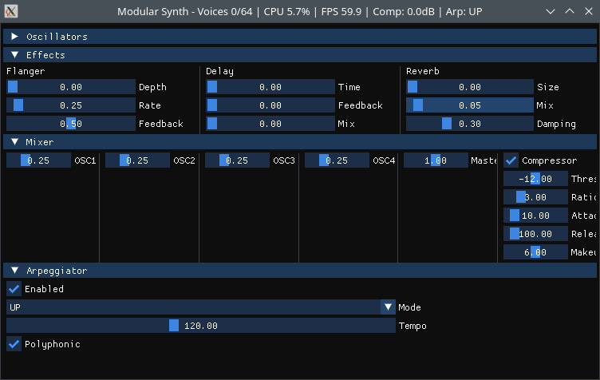

# Modular Synth

A modular synthesizer application written in C, using SDL2 for graphics and audio, and supporting MIDI input via RtMidi. The GUI is resizable and features oscilloscope and spectrum displays, keyboard input, and real-time control of oscillators, effects, mixer, and arpeggiator.

## Screenshot



## Features

- **4-oscillator synth**: Each with independent waveform, pitch, detune, gain, and phase.
- **Mixer**: Control the mix and master volume of each oscillator.
- **Effects**: Flanger, delay, and reverb with real-time controls.
- **Arpeggiator**: Multiple modes, adjustable tempo, and enable/disable.
- **Oscilloscope & Spectrum**: Visualize output waveform and frequency spectrum.
- **MIDI input**: Map MIDI CC to synth parameters for external control.
- **Resizable GUI**: Layout adapts to window size.

## Dependencies

- [SDL2](https://www.libsdl.org/) (graphics, audio, events)
- [SDL2_ttf](https://github.com/libsdl-org/SDL_ttf) (font rendering)
- [SDL2_gfx](https://www.ferzkopp.net/Software/SDL2_gfx/Docs/html/index.html) (graphics primitives)
- [RtMidi](https://github.com/thestk/rtmidi) (MIDI input)
- [math.h], [string.h], [stdlib.h], [stdio.h]
- A TrueType font (e.g., DejaVuSans.ttf; see below)

## Build Instructions

### Linux

Install dependencies (example for Debian/Ubuntu):

```sh
sudo apt-get install libsdl2-dev libsdl2-ttf-dev libsdl2-gfx-dev librtmidi-dev
```

Clone and build:

```sh
git clone <your-repo-url>
cd <your-repo>
make
```

### macOS

Install dependencies (with Homebrew):

```sh
brew install sdl2 sdl2_ttf sdl2_gfx rtmidi
```

Then build as above.

### Windows

- Install SDL2, SDL2_ttf, SDL2_gfx and RtMidi development libraries.
- Use MinGW or Visual Studio to build the sources (adjust includes/libs as needed).

## Running

```sh
./synth
```

The application will open a window with the synthesizer GUI.

## Notes

- The application expects to find a TrueType font (such as `DejaVuSans.ttf`) in `/usr/share/fonts/truetype/dejavu/DejaVuSans.ttf` or the current directory.
- MIDI input is mapped to numerous parameters (see `src/midi.c` for mapping).
- All GUI controls respond to mouse drag and mouse wheel.
- The oscilloscope is fed directly from the audio callback thread for real-time visualization.

## File Overview

- `src/`: Source code for synth, GUI, effects, MIDI, etc.
- `src/gui.c`, `src/gui.h`: GUI rendering and event handling.
- `src/oscilloscope.c`, `src/oscilloscope.h`: Oscilloscope/spectrum visualization.
- `src/synth.c`, `src/synth.h`: Synth core and audio callback.
- `src/osc.c`, `src/osc.h`: Oscillator code.
- `src/fx.c`, `src/fx.h`: Effects (flanger, delay, reverb).
- `src/midi.c`, `src/midi.h`: MIDI input and mapping.
- `src/voice.c`, `src/voice.h`: Voice management.
- `src/mixer.c`, `src/mixer.h`: Mixer logic.
- `src/arpeggiator.c`, `src/arpeggiator.h`: Arpeggiator logic.
- `src/app.c`, `src/app.h`, `src/main.c`: Application entry point, SDL setup, main loop.

## License

MIT License (see [LICENSE](LICENSE))

## Credits

- [SDL2](https://www.libsdl.org/)
- [SDL2_ttf](https://www.libsdl.org/projects/SDL_ttf/)
- [SDL2_gfx](https://www.ferzkopp.net/Software/SDL2_gfx/Docs/html/index.html)
- [RtMidi](https://github.com/thestk/rtmidi)
- [DejaVu Fonts](https://dejavu-fonts.github.io/)
